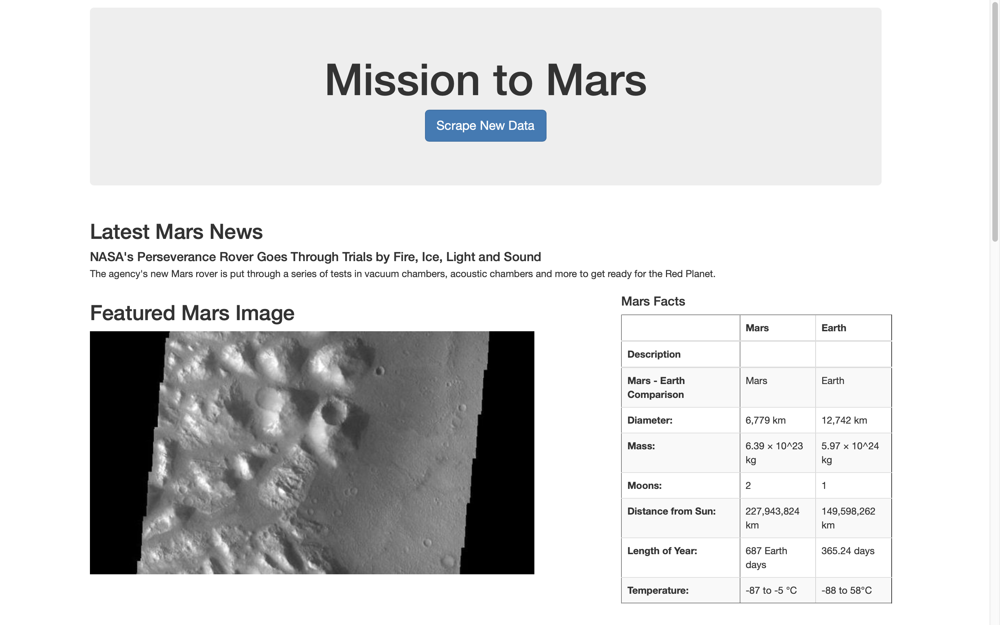
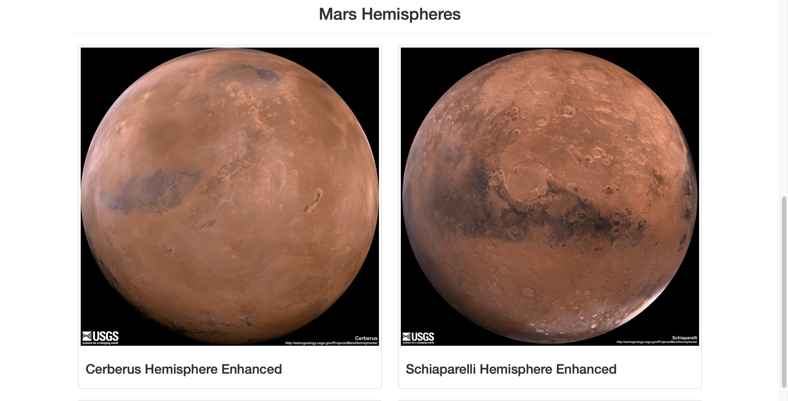
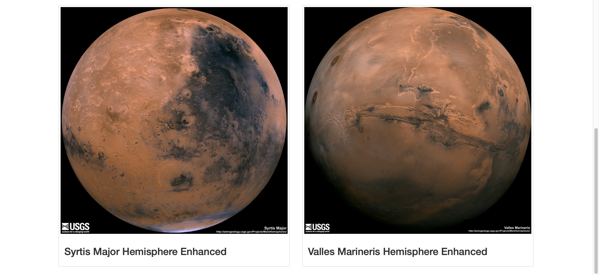

# Mission to Mars
### Overview

The project scrapes data from various websites to create an new webpage, highlighting facts about the planet Mars. In order to do so, we are using splinter and beautiful soup libraries to scrape the relevant data. then, its transformed to a MongoDB Database before uploading the data to the webpage using flask. Lastly, we use bootstrap to cleanup the webpage and make it presentable.

Here is a screenshot of the resulted webpage.

